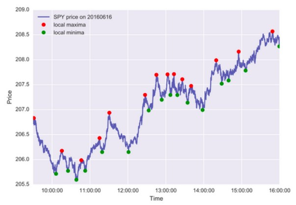

## Just Facts (Like a proficient NLP bot)
I learnt a lot in Software development and Algorithm development.
Software Development: (ORS, ExecutionSimulation, ReconciliationPipeline, PorfolioSimulation)
Algorithms.
Machine Learning

### Execution System
So, as we have seen, porfolio management system says something like this, "After looking at the prices of stocks and
etfs of past few days, I, in my genius intelligence and ultimate authority, think that for the user ABC, we should buy
n1 shares of APPL, sell n2 shares of VTI and so on and so forth". It sends these orders to execution system.

For every order, execution system looks at price data at minisecond/microsecond granularity and decides upon the best
time in near future to execute the order. If it is a buy order, the system attempts to send the order at the time when
the price is low. For a sell order, target is naturally to sell at a relatively higher price.

<!--  -->

### Order Routing Server (ORS)
Exchange speaks a different language. Trading system speaks another. ORS is the interpreter which receives messages from
one and translates it to the other. A buy order request, sell order request, order price modification request etc are
some examples of messages which Trading system sends to Exchange. Order confirmation notification, order cancellation
notification etc. are few examples of messages sent by the exchange.

