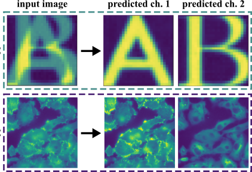

<!-- ---
title: "PhD & Prior Research"
--- -->

# PhD Research

During my PhD in the [Jug Lab](https://humantechnopole.it/en/people/florian-jug/), I worked on image decomposition tasks for microscopy data. Fluorescence microscopy is a vital tool in life sciences, enabling visualization of cellular and sub-cellular structures using fluorescent markers. However, technical constraints limit the number of structures that can be imaged simultaneously. My PhD addresses this limitation by proposing methods to decompose superimposed fluorescence images—where multiple structures are captured in a single channel—into distinct channels through super- vised image decomposition and unsupervised denoising. Given a superimposed (noisy) image, the task is to decompose it into its constituent channels.

Below are the specific projects I worked on during my PhD:

* **[scSplit](https://neurips.cc/virtual/2025/loc/mexico-city/poster/115037)**: An architecture designed to have generalization with respect to the mixing-ratio, which is the relative strength of structures superimposed on an image (NeurIPS 25).
* **[MicroSplit](https://www.biorxiv.org/content/10.1101/2025.02.10.637323v1)**: Combining uSplit and denoiSplit into a single network, thereby acquiring GPU efficiency and self-supervised denoising into a single architecture. A comprehensive evaluation on 36 semantic unmixing tasks from 9 datasets, in collaboration with 8 other labs (Accepted at Nature Methods 2026).
* **[denoiSplit](https://ashesh-0.github.io/denoiSplit/)**: An architecture for unsupervised denoising together with decomposition, supporting multi-prediction and model calibration (ECCV 24).
* **[microSSIM](https://ashesh-0.github.io/MicroSSIM/)**: A variant of SSIM suited for unsupervised denoising tasks on microscopy data (BIC workshop, ECCV 24).
* **[uSplit](https://ashesh-0.github.io/uSplit/)**: A HVAE inspired architecture for efficient image decomposition (ICCV 23).
* **[Latent Space Splitting](/structural_noise_removal.md)**: Structural noise removal using contrastive learning on the latent space.

## Code Contributions
On the coding side, I've been interested in contributing to microscopy data related code: (a) [c-mda-engine](https://github.com/pymmcore-plus/c-mda-engine), a proof-of-concept C++ based engine for controlling microscopes. Idea was to move re-usable code from different downstream applications to a common codebase and use [SWIG](https://www.swig.org/Doc1.3/Python.html) to generate python bindings. (b) I recently (May 2024) started contributing to [microsim](https://github.com/ashesh-0/microsim), a light microscopy simulator. (c) I created a python package [predtiler](https://pypi.org/project/predtiler/), a light-weight package which enables tiled prediction in any dataset class used with pytorch with minimal changes in the dataset class code.

# Prior Research & Experience in Industry
Prior to my PhD, I was working as a Research Assistant in [National Taiwan University](https://www.ntu.edu.tw/english/), Taipei under Prof. [Hsuan-Tien Lin](https://www.csie.ntu.edu.tw/~htlin/). There, I worked on two computer vision tasks: estimating gaze of a person, given the headshot image, and estimating rainfall amount in the next 1,2 and 3 hours. I published two first-author works:
* 3D Gaze estimation in the wild. [BMVC 2021](https://www.bmvc2021-virtualconference.com/conference/papers/paper_0643.html).
* Extreme precipitation prediction. [Problem Statement](/pages/extreme_rainfall_prediction.md), [Paper Link](https://journals.ametsoc.org/view/journals/aies/1/3/AIES-D-21-0005.1.xml).

:

* **[Gaze Estimation](/gaze_estimation.md)**: My work on 3D Gaze estimation in the wild at Vision-lab, NTU (BMVC 2021).
* **[Qplum](/qplum.md)**: My experience and learnings working as a Data Scientist at the online investment advisory firm Qplum.
